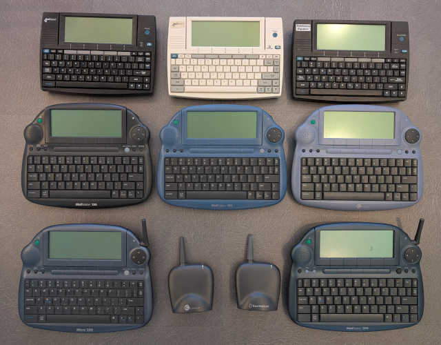

# A guide to MailStation models

This document is intended as a reference documenting the various hardware models of the MailStation, the differences between them, and their hackability. 

*Top row: Various incarnations of Mivo 100.*
*Middle row: Mivo 120, Mivo 150, Mivo 200.*
*Bottom row: Mivo 250, Mivo 350.*

## The original MailStation (Mivo 100 = DET1)

This is the first version of the MailStation, and by far the most popular. It has a small rectangle case, and can come either in a black or white color. The black units run 2.5x firmware while the white ones run 3.0x, but otherwise these units are identical hardware-wise [^1]. You can flash a 3.0x firmware onto a black unit, or downgrade the white one to 2.5x, and everything will still work. 

These units were also sold by some OEMs, for example Pacific Bell in the US (running some older 1.x firmware) or Telefonica in Argentina (using a yet undetermined firmware version, and a Spanish keyboard with some keys moved or redefined). All of them have a 33.6 kbps Conexant RCV336ACFW modem chip. 

Regardless of the firmware version, you can always get to the diagnostics menu by pressing *Function+Shift+T* upon power on. Since this was the first version of the computer, it is reasonably well documented and some programs will only run reliably on this model. Therefore it is recommended to get this one if you plan to hack your machine. Unfortunately, the keyboard of these models is really cramped: the keys are very small and, depending on the particular machine, quite wobbly, so typing longer texts on them is really uncomfortable. 

# The new MailStations

After the original one, a plethora of different models were introduced, which can be a bit confusing. They can be distinguished by a new, rounded design that comes in various shades of blue, and all run 4.0x firmware. They have better and bigger keyboards, but the hardware is not fully compatible with the old machines as well as between the various models. This means that every computer needs to be flashed with a firmware that is tailored to that particular model. Also the key combination to enter the diagnostics menu is now different in each firmware version; for many models, it is simply not known. 

## High end models (Mivo 200 = DET2, Mivo 250 = DET2B)

These models have the same LCD screen controller as the old machines, but a new keyboard layout, so software written for the old models will not be able to read certain keys. They also have a different modem chip (Conexant CX88168-12), but it is still a 33.6 kbps one. 

The Mivo 250 is "wireless", in the sense that the modem, in addition to a phone jack, can also be connected via a 900 MHz module to a base station which in turn is connected to a phone jack. There is no WiFi connectivity!

## Low end models (Mivo 120 = DET1E, Mivo 150 = DET1D)

These models have the modem chip changed again to Conexant RC224ATL, which supports only 2400 baud - really slow for an Internet appliance from 2001. In addition to the new keyboard, they also have a different screen controller, so software written for the old machines will have a completely garbled display, or no display at all. Interestingly, the new screen uses an LCD controller located in the CPU, which apparently sat there unused since the Mivo 100 days. Despite bearing the DET1 moniker, they are the least compatible with the original MailStation. 

The 150 is also a relatively popular machine and you can find a lot of them for sale on Ebay. There are apparently no hardware differences between the 120 and the 150 besides the case color, with the caveat that a real 120 is very hard to find: most of the 120's were simply rebadged 200's with a firmware that shows "MailStation 120" on the main screen, as if there was still not enough confusion. 

## The 16-bit model (Mivo 350)

This machine uses a completely different CPU, a 16-bit Toshiba microcontroller, as well as an upgraded screen with a better resolution and color depth. Since the platform differs so much from the previous models, it falls outside the scope of this documentation. 

[^1]: Well, not exactly: early machines were equipped with a Caller ID function which could be used to identify the caller's number when the computer was attached to the phone line. This feature was seldom used and was quickly dropped; none of my machines have the Caller ID chip. See also footnote #1 in the [I/O port description](ports.md).
